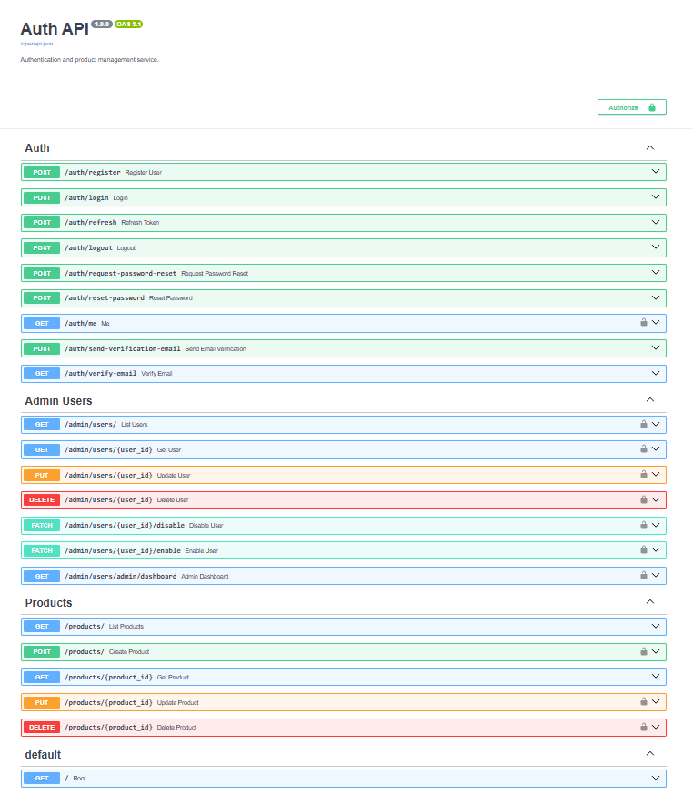

# 🚀 FastAPI Auth API

An **Enterprise-grade Authentication, Authorization & Product Management API** built with **FastAPI**, featuring advanced security mechanisms, role-based access control, and robust testing coverage.

---

## 📘 Table of Contents

- [🚀 FastAPI Auth API](#-fastapi-auth-api)
- [🔥 Overview](#-overview)
- [⚡ Key Features](#-key-features)
  - [🔐 Authentication & Security](#-authentication--security)
  - [👮 RBAC – Role-Based Access Control](#-rbac--role-based-access-control)
  - [🛍 Product Management](#-product-management)
  - [📩 Email Service](#-email-service)
  - [🧪 Tests Routines](#-tests-routines)
- [🏗 Project Architecture](#-project-architecture)
- [🛠 Technologies](#-technologies)
- [💻 Installation](#-installation)
- [⚙ Environment Variables](#-environment-variables)
- [▶ Running the Project](#-running-the-project)
- [📘 Documentation & Postman](#-documentation--postman)
- [🔑 Authentication & Token Flow](#-authentication--token-flow)
  - [➜🚪 Login](#-login)
  - [🎫 Refresh Token](#-refresh-token)
  - [⏻ Logout](#-logout)
- [🧩 Permissions & RBAC](#-permissions--rbac)
- [📂 Directory Structure](#-directory-structure)
- [🧪 Tests](#-tests)
- [🐳 Docker](#-docker)
- [📜 License](#-license)
- [👤 Author](#-author)
- [💬 Feedback](#-feedback)

---

## 🔥 Overview

SecureAuth API is a complete authentication, authorization, security, auditing, and product management API built with FastAPI and designed for real production environments.

Includes:

✔ Full JWT authentication  
✔ Refresh tokens with rotation & revocation  
✔ Bruteforce protection (attempt limiting)  
✔ Centralized security logging  
✔ Permission validation (RBAC)  
✔ Professional product CRUD  
✔ Email sending support (Brevo/SMTP)  
✔ Full test suite (100% isolated & mocked)  
✔ Automatic documentation + Postman Collection  

---

## ⚡ Key Features

### 🔐 Authentication & Security

- Registration with email verification  
- Secure login using bcrypt  
- Access JWT + Rotating Refresh Tokens  
- Logout with token revocation  
- Reuse detection of refresh tokens  
- Bruteforce protection  
- IP & email rate limiting  
- Persistent security logs  

### 👮 RBAC – Role-Based Access Control

| Role        | Permissions                                             |
|-------------|---------------------------------------------------------|
| superadmin  | Full control (users, products, permissions)             |
| admin       | Product CRUD + Basic management                         |
| user        | Standard access                                         |

### 🛍 Product Management

- Full CRUD  
- Pydantic validation  
- Only accessible to admins/superadmins  

### 📩 Email Service

- Account creation notification  
- Password reset link  
- Automatic email mocking during tests  

### 🧪 Tests Routines

- Complete test suite with Pytest  
- Powerful fixtures  
- Email mocking  
- Tests for refresh token flow, security, rate limiting, roles, products, and more  



---

## 🏗 Project Architecture

The API follows modern architecture standards:

- Repository Pattern  
- Service Layer  
- Models → Schemas → Services → Routers  
- Clear separation of Domain / Infrastructure / Application  
- Typed settings using Pydantic  

Flow:

Request → Router → Service → Repository → Database
→ Security Logs → Response

---

## 🛠 Technologies

- FastAPI  
- Python 3.10+  
- SQLAlchemy  
- PyJWT  
- bcrypt  
- pytest  
- Docker / Docker Compose  
- Brevo SMTP  
- SQLite or PostgreSQL 

---

## 💻 Installation

```bash
git clone https://github.com/CelmarPA/fastapi-auth-api

cd fastapi-auth-api
python -m venv venv
source venv/bin/activate # Windows: venv\Scripts\activate
pip install -r requirements.txt
```

---

## ⚙ Environment Variables

Rename `.env.example` file inside the `app/` directory to `.env`:

```
ENVIRONMENT=development
DATABASE_URL=sqlite:///./test.db
SECRET_KEY=CHANGE_ME
ALGORITHM=HS256
ACCESS_TOKEN_EXPIRE_MINUTES=30
REFRESH_TOKEN_EXPIRE_DAYS=7
CORS_ORIGINS='["http://localhost:3000", "http://127.0.0.1:3000"]'
BREVO_API_KEY=<YOUR_API_KEY_BREVO>
EMAIL_FROM=<YOUR_EMAIL>
EMAIL_FROM_NAME=<NAME>
```

---

## ▶ Running the Project

```bash
uvicorn app.main:app --reload
```

Swagger UI: [http://127.0.0.1:8000/docs](http://127.0.0.1:8000/docs)

Redoc UI: [http://127.0.0.1:8000/redoc](http://127.0.0.1:8000/redoc)

---

## 📘 Documentation & Postman

Postman collections included:

```
docs/postman/
│── SecureAuth API.postman_collection.json
│── SecureAuth API.yaml
│── README.md
```

Import via:

Postman → Collections → Import → Select `.json`

Includes:

- Authentication  
- Users/Admin  
- Products  
- Security Logs  
- Email Flow  
- Refresh Flow  
- Tokens  

---

## 🔑 Authentication & Token Flow

### ➜🚪 Login

POST /auth/login

### 🎫 Refresh Token

POST /auth/refresh

### ⏻ Logout

POST /auth/logout

---

## 🧩 Permissions & RBAC

Example: @router.get("/dashboard", dependencies=[Depends(admin_required)])

---

## 📂 Directory Structure

```
auth_api/
│
├── app/
│   ├── core/
│   │   ├── bruteforce.py
│   │   ├── config.py
│   │   ├── exception_handlers.py
│   │   ├── permissions.py
│   │   ├── rate_limit.py
│   │   ├── rate_limit_custom.py
│   │   ├── security.py
│   │   ├── security_log.py
│   │   └── tokens.py
│   │
│   ├── models/
│   │   ├── login_attempt.py
│   │   ├── password_reset_log.py
│   │   ├── products.py
│   │   ├── refresh_token.py
│   │   ├── reset_token.py
│   │   ├── security_log.py
│   │   └── user.py
│   │
│   ├── repositories/
│   │   ├── reset_repository.py
│   │   ├── security_log_repository.py
│   │   ├── token_repository.py
│   │   └── user_repository.py
│   │
│   ├── routers/
│   │   ├── admin_users.py
│   │   ├── auth.py
│   │   └── products.py
│   │
│   ├── schemas/
│   │   ├── auth_schema.py
│   │   ├── message_schema.py
│   │   ├── password_reset_schema.py
│   │   ├── product_schema.py
│   │   ├── security_log_schema.py
│   │   ├── token_schema.py
│   │   └── user_schema.py
│   │
│   ├── services/
│   │   ├── auth_service.py
│   │   ├── email_client.py
│   │   ├── email_service.py
│   │   ├── reset_service.py
│   │   └── user_service.py
│   │
│   ├── tests/
│   │   ├── conftest.py
│   │   ├── test_auth_logout.py
│   │   ├── test_auth_password_reset.py
│   │   ├── test_auth_refresh.py
│   │   ├── test_auth_register.py
│   │   ├── test_auth_roles.py
│   │   ├── test_auth_security.py
│   │   ├── test_auto_crud.py
│   │   ├── test_email_service.py
│   │   ├── test_products.py
│   │   ├── test_refresh_tokens.py
│   │   └── test_security_log.py
│   │
│   ├── database.py
│   ├── main.py
│   └── __init__.py
│
├── docs/
│   └── postman/
│       ├── Auth API.postman_collection.json
│       ├── Auth API.yaml
│       └── README.md
│
├── docker-compose.yaml
├── Dockerfile
├── pytest.ini
├── .env.example
├── README.md
└── requirements.txt
```

---

## 🧪 Tests
```bash
pytest
pytest --cov=app --cov-report=html
pytest --html=report.html --self-contained-html
```

---

## 🐳 Docker

```bash
docker-compose up --build
```

Includes:

- FastAPI API  
- Database (SQLite local or PostgreSQL)  
- Production-ready setup  

---

## 📜 License

This project is open-source and free to use for learning or personal projects.  
Licensed under the **MIT License**.

---

## 👤 Author

**Celmar Pereira**

- [GitHub](https://github.com/CelmarPA)
- [LinkedIn](https://www.linkedin.com/in/celmar-pereira-de-andrade/)

---

## 💬 Feedback

Enjoy the app and feel free to suggest improvements or open issues!
